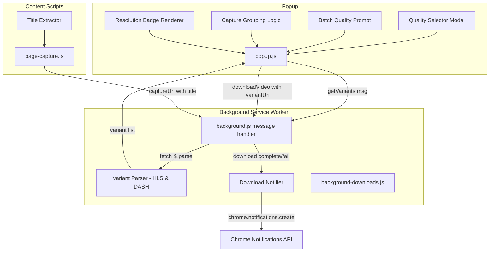
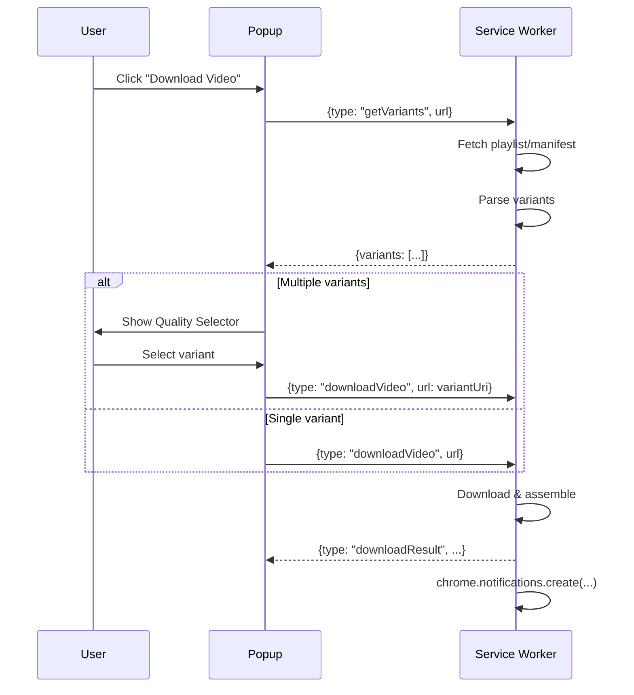
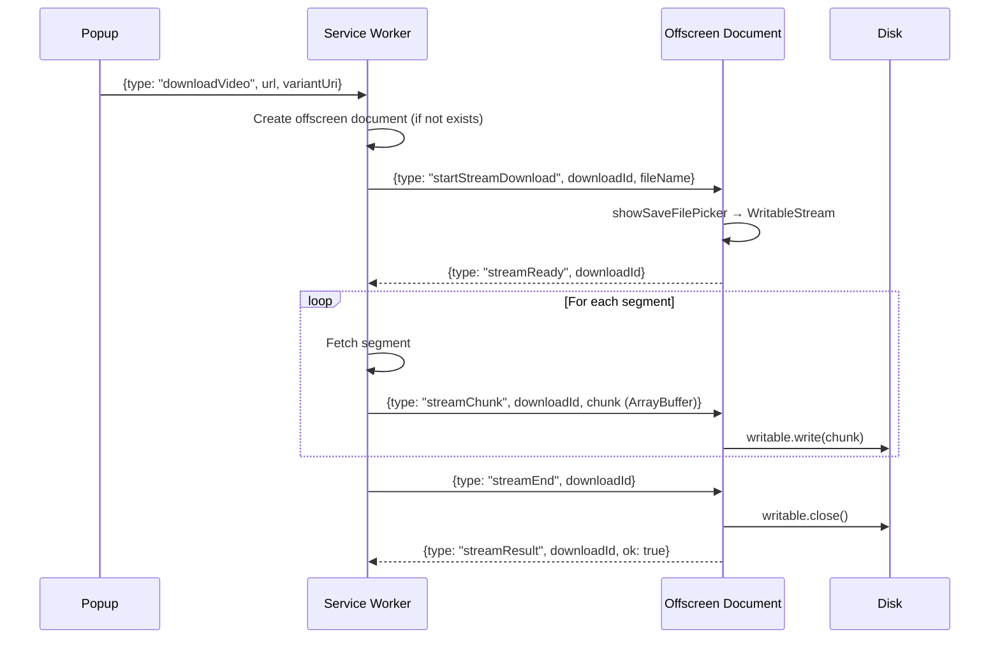

# Design Document: M3U8 Catcher Enhancements

## Overview

This design covers six enhancements to the M3U8 Catcher Chrome extension: quality variant parsing for HLS and DASH, a quality selector UI, download completion notifications, batch download with quality choice, duplicate/related capture grouping, smarter video title extraction from page DOM, resolution badges on thumbnails, and streaming-to-disk downloads.

The changes span four layers of the extension:
1. **Background service worker** — new message types for variant parsing, notification dispatch, variant-aware download initiation, and streaming coordination.
2. **Offscreen document** — a hidden page that hosts `showSaveFilePicker` / `WritableStream` for streaming segments directly to disk without buffering in RAM.
3. **Content scripts** — DOM-based title extraction logic injected into pages.
4. **Popup UI** — quality selector modal, batch quality prompt, capture grouping, and resolution badge rendering.

The design preserves the existing architecture (message-passing between popup ↔ service worker, `chrome.storage.local` for state) and adds new modules/functions alongside existing ones rather than rewriting.

## Architecture



### Message Flow for Quality Selection



## Components and Interfaces

### 1. Variant Parser (`background/background-variants.js` — new module)

Exports two pure functions that parse playlist/manifest text and return a normalized variant list.

```typescript
interface Variant {
  uri: string;           // Absolute URL to the variant playlist/representation
  resolution: string;    // e.g. "1920x1080", or "" if unknown
  bandwidth: number;     // bits per second
  label: string;         // Human-readable label, e.g. "1080p · 4.5 Mbps"
}

function parseHlsVariants(playlistText: string, baseUrl: string): Variant[]
function parseDashVariants(mpdText: string, baseUrl: string): Variant[]
```

- `parseHlsVariants` reuses the existing `parseAttributeList` helper and `#EXT-X-STREAM-INF` parsing logic from `background-downloads.js`, but returns the full variant list instead of auto-selecting the highest bandwidth.
- `parseDashVariants` parses `<AdaptationSet>` nodes with `mimeType` starting with `video/` (or `contentType="video"`), iterates `<Representation>` children, and extracts `@width`, `@height`, `@bandwidth`, and `@id`.
- Both functions sort variants from highest resolution to lowest.
- The `label` field is derived: resolution height + "p" + formatted bitrate (e.g., "1080p · 4.5 Mbps").

### 2. New Message Types in `background.js`

#### `getVariants`
- Request: `{ type: "getVariants", url: string, format?: string }`
- Response: `{ ok: true, variants: Variant[] }` or `{ ok: false, error: string }`
- The handler fetches the playlist/manifest, detects format (HLS vs DASH), calls the appropriate parser, and returns the variant list.
- If the playlist is a media playlist (no `#EXT-X-STREAM-INF`) or a single-representation MPD, returns `{ ok: true, variants: [] }` (empty array signals single-variant).

#### Modified `downloadVideo`
- Accepts an optional `variantUri` field. When present, the service worker downloads that specific variant URI instead of auto-selecting.

### 3. Download Notifier (`background/background-notifications.js` — new module)

```typescript
function notifyDownloadComplete(filename: string): void
function notifyDownloadFailed(errorMessage: string): void
```

- Uses `chrome.notifications.create` with `type: "basic"`.
- Sets a timeout of 8 seconds, then calls `chrome.notifications.clear`.
- Requires `"notifications"` permission in `manifest.json`.

### 4. Quality Selector UI (Popup)

A modal overlay in the popup that displays when `getVariants` returns 2+ variants.

- Renders a sorted list of variants (highest to lowest resolution).
- First item is always "Highest quality" (selects the variant with max bandwidth).
- Each row shows: resolution label (e.g., "1080p"), bitrate (e.g., "4.5 Mbps").
- Clicking a row sends `downloadVideo` with the selected `variantUri`.
- Clicking outside or pressing Escape dismisses the modal and cancels the download.
- HTML structure added to `popup.html`; styling added to `popup.css`.

### 5. Batch Quality Prompt (Popup)

When "Download All" is clicked and at least one capture is multi-variant:

1. Popup sends `getVariants` for each playlist-format capture in the filtered list.
2. Collects all unique resolution tiers across streams.
3. Displays a prompt with options: "Highest", "Lowest", and each common resolution tier (e.g., "1080p", "720p", "480p").
4. On selection, iterates captures and picks the variant closest to the chosen resolution for each multi-variant stream. Single-variant and direct-video captures download as-is.
5. Dismissing the prompt cancels the batch operation.

### 6. Capture Grouping Logic (Popup)

A pure function in `popup.js` that groups captures before rendering:

```typescript
interface CaptureGroup {
  primary: Capture;       // Highest resolution or most recent
  related: Capture[];     // Other captures in the group
}

function groupCaptures(captures: Capture[]): CaptureGroup[]
```

- Groups by: same `sourcePage` URL AND shared URL path prefix (everything except the final path segment and query params).
- Groups with 1 capture render as normal rows.
- Groups with 2+ captures render as a collapsed row with a "+N related" badge.
- Clicking the badge expands to show all captures in the group.
- Recalculated on every render (refresh, storage change, search filter change).

### 7. Title Extractor (`content/page-capture.js` — enhanced)

Added to the existing content script's `sendCapture` function:

```typescript
function extractVideoTitle(): string | null
```

Priority order:
1. `<meta property="og:title">` content attribute
2. First `<h1>` element's `textContent`
3. Elements matching `[class*="video-title"], [class*="player-title"], [data-video-title]`

Post-processing:
- Trim whitespace
- Truncate to 200 characters
- Remove invalid filename characters: `< > : " / \ | ? *` and control characters (U+0000–U+001F)

If no title found, omit the field (existing tab-title fallback in service worker handles it).

### 8. Resolution Badge (Popup)

- During thumbnail generation via HLS.js, capture `videoWidth` and `videoHeight` from the `<video>` element after the first frame is seeked.
- Store resolution in a `resolutionCache` map (keyed by URL) alongside existing `thumbCache` and `durationCache`.
- Persist to `chrome.storage.local` under key `m3u8_resolutions`.
- Render a badge element positioned at top-left of the `.row-thumb` container with class `.thumb-resolution`.
- Display format: vertical resolution + "p" (e.g., "1080p", "720p").
- Styling: semi-transparent dark background, white text, matching the existing `.thumb-duration` badge style.

### 9. Streaming-to-Disk Downloads (`offscreen/offscreen.html` + `offscreen/offscreen.js` — new)

The current download approach buffers all segments in RAM before saving. For large videos (1+ GB), this is unsustainable. The solution uses Chrome's Offscreen Documents API to host `showSaveFilePicker` + `WritableStream`, streaming segments to disk as they arrive.

#### Architecture



#### Offscreen Document (`offscreen/offscreen.js`)

```typescript
// Manages active WritableStream instances keyed by downloadId
const activeStreams: Map<string, FileSystemWritableFileStream>

// Message handler
chrome.runtime.onMessage.addListener((msg) => {
  switch (msg.type) {
    case "startStreamDownload":
      // Call showSaveFilePicker with suggestedName
      // Store writable in activeStreams
      // Reply with streamReady
    case "streamChunk":
      // Write chunk to activeStreams[downloadId]
    case "streamEnd":
      // Close writable, remove from activeStreams, reply with result
    case "streamAbort":
      // Abort writable, remove from activeStreams
  }
})
```

#### Service Worker Changes

- Before starting a streaming download, call `chrome.offscreen.createDocument` with `reasons: ["WORKERS"]` and `justification: "Stream video segments directly to disk"`.
- Check if offscreen document already exists before creating (avoid duplicates).
- Modify `downloadVideoFromPlaylist` and `downloadDashVideo` to use a streaming mode that sends each segment to the offscreen document via `chrome.runtime.sendMessage`.
- If `showSaveFilePicker` is not available in the offscreen document (browser doesn't support it), fall back to the existing RAM-buffered `chrome.downloads.download` approach.

#### Fallback Behavior

The offscreen document attempts `showSaveFilePicker`. If it throws (unsupported or user cancels), it sends `{type: "streamFallback"}` back to the service worker, which then uses the existing RAM-buffered download path.

#### Manifest Changes

```json
{
  "permissions": [..., "offscreen"]
}
```

## Data Models

### Variant (new)

```json
{
  "uri": "https://cdn.example.com/stream/1080p/index.m3u8",
  "resolution": "1920x1080",
  "bandwidth": 4500000,
  "label": "1080p · 4.5 Mbps"
}
```

### Capture (existing, extended)

The existing capture object stored in `chrome.storage.local` under `m3u8Captures` gains no new persisted fields. Resolution data is stored separately in the resolution cache.

### Resolution Cache (new, in `chrome.storage.local`)

```json
{
  "m3u8_resolutions": {
    "https://cdn.example.com/stream/master.m3u8": "1080p",
    "https://cdn.example.com/video.mp4": "720p"
  }
}
```

### Notification (transient)

```json
{
  "type": "basic",
  "iconUrl": "icons/icon128.png",
  "title": "Download Complete",
  "message": "video-title.mp4"
}
```


## Correctness Properties

*A property is a characteristic or behavior that should hold true across all valid executions of a system — essentially, a formal statement about what the system should do. Properties serve as the bridge between human-readable specifications and machine-verifiable correctness guarantees.*

### Property 1: HLS master playlist parsing extracts all variants

*For any* valid HLS master playlist text containing N `#EXT-X-STREAM-INF` entries each followed by a URI line, `parseHlsVariants` shall return exactly N variant objects, and each variant's `bandwidth` and `resolution` shall match the corresponding `BANDWIDTH` and `RESOLUTION` attributes in the source text.

**Validates: Requirements 1.1, 1.3**

### Property 2: Media playlists produce empty variant list

*For any* valid HLS media playlist text (containing `#EXTINF` segment entries but no `#EXT-X-STREAM-INF` entries), `parseHlsVariants` shall return an empty array.

**Validates: Requirements 1.2**

### Property 3: DASH MPD parsing extracts all video representations

*For any* valid DASH MPD XML document containing M video `<Representation>` elements across all video `<AdaptationSet>` nodes, `parseDashVariants` shall return exactly M variant objects, and each variant's `bandwidth` shall match the `@bandwidth` attribute and `resolution` shall match the `@width` x `@height` attributes of the corresponding `<Representation>`.

**Validates: Requirements 2.1, 2.3**

### Property 4: Variant list is sorted by resolution descending

*For any* variant list produced by `parseHlsVariants` or `parseDashVariants`, the variants shall be ordered such that each variant's vertical resolution is greater than or equal to the next variant's vertical resolution (i.e., sorted highest to lowest).

**Validates: Requirements 3.2**

### Property 5: Highest quality selects maximum bandwidth

*For any* non-empty variant list, the "highest quality" selection shall return the variant whose `bandwidth` value is strictly greater than or equal to all other variants' `bandwidth` values in the list.

**Validates: Requirements 3.4**

### Property 6: Closest variant selection picks nearest resolution

*For any* target resolution height and any non-empty variant list, the closest-variant selection function shall return the variant whose absolute difference in vertical resolution from the target is minimal. If two variants are equidistant, the one with higher bandwidth shall be preferred.

**Validates: Requirements 5.2**

### Property 7: Capture grouping correctness

*For any* list of captures, `groupCaptures` shall produce groups such that: (a) every capture in a group shares the same `sourcePage` URL and the same URL path prefix (excluding the final path segment and query parameters) as all other captures in that group, and (b) no two different groups contain captures that share both the same `sourcePage` and the same URL path prefix.

**Validates: Requirements 6.1**

### Property 8: Title extraction follows priority order

*For any* DOM state containing a combination of `<meta property="og:title">`, `<h1>` elements, and elements matching `[class*="video-title"], [class*="player-title"], [data-video-title]`, the `extractVideoTitle` function shall return the value from the highest-priority non-empty source (og:title > h1 > video-title selectors), or null if all sources are empty.

**Validates: Requirements 7.1**

### Property 9: Title sanitization preserves valid characters and enforces length

*For any* input string, the title sanitization function shall: (a) produce output containing no characters from the set `< > : " / \ | ? *` and no control characters (U+0000–U+001F), (b) produce output with length at most 200 characters, and (c) produce output with no leading or trailing whitespace.

**Validates: Requirements 7.4, 7.5**

### Property 10: Streaming download memory bound

*For any* streaming download of N segments, the peak memory held by the offscreen document at any point during the download shall not exceed the size of one segment buffer plus a constant overhead (message serialization). The offscreen document shall not accumulate segment buffers.

**Validates: Requirements 7.4, 7.5**

## Error Handling

| Scenario | Handling |
|---|---|
| Playlist fetch fails (network error, 4xx, 5xx) | `getVariants` returns `{ ok: false, error: "..." }`. Popup shows error in status bar. No quality selector shown. |
| Playlist text is malformed / unparseable | Parser returns empty variant list. Popup treats as single-variant and proceeds with direct download. |
| MPD XML is invalid | `parseDashVariants` catches XML parse errors and returns empty array. Popup falls back to direct download. |
| `chrome.notifications.create` fails | Catch error, log to console. Download result is still communicated to popup via message passing. Notification failure is non-blocking. |
| Notification permission not granted | `chrome.notifications.create` will fail silently. Extension continues to function without notifications. |
| Title extraction throws (DOM access error) | `extractVideoTitle` wraps all DOM access in try/catch, returns null on any error. Fallback to tab title. |
| Batch download: one stream fails | Individual failure is reported via `downloadResult` message. Other downloads in the batch continue. Batch progress UI updates to show the failure. |
| Capture grouping with malformed URLs | `groupCaptures` wraps URL parsing in try/catch. Captures with unparseable URLs are placed in their own single-capture group. |
| Resolution detection fails during thumbnail generation | Resolution cache stores `null` for that URL. No resolution badge is displayed. |
| Storage quota exceeded for resolution/thumbnail caches | Catch storage errors, log warning. Caches work in-memory only for that session. |
| `showSaveFilePicker` not supported or user cancels | Offscreen document sends `streamFallback` message. Service worker falls back to RAM-buffered `chrome.downloads.download`. |
| Offscreen document creation fails | Catch error, log warning, fall back to RAM-buffered download. |
| `WritableStream.write` fails mid-download | Offscreen document aborts the stream, notifies service worker with error. Service worker reports failure via `downloadResult`. |
| Disk full during streaming write | `WritableStream.write` throws. Offscreen document aborts and reports error. |

## Testing Strategy

### Unit Tests (Example-Based)

- **Quality Selector UI**: Verify modal appears when 2+ variants returned, verify dismissal cancels download, verify single-variant skips modal.
- **Batch Quality Prompt**: Verify prompt appears when multi-variant captures exist, verify dismissal cancels batch, verify single-variant captures download without quality choice.
- **Notification dispatch**: Mock `chrome.notifications.create` and verify correct title/message for success and failure cases. Verify `chrome.notifications.clear` called after 8 seconds (with fake timers).
- **Capture group rendering**: Verify collapsed row shows "+N related" badge, verify expansion reveals all captures, verify single-capture groups render as normal rows.
- **Resolution badge rendering**: Verify badge appears when resolution is known, verify no badge when resolution is unknown.
- **Manifest permission**: Verify `manifest.json` includes `"notifications"` permission.

### Property-Based Tests

Property-based tests use [fast-check](https://github.com/dubzzz/fast-check) for JavaScript. Each property test runs a minimum of 100 iterations.

| Property | Test Description | Tag |
|---|---|---|
| Property 1 | Generate random HLS master playlists, verify variant count and field values | Feature: m3u8-catcher-enhancements, Property 1: HLS master playlist parsing extracts all variants |
| Property 2 | Generate random HLS media playlists, verify empty variant array | Feature: m3u8-catcher-enhancements, Property 2: Media playlists produce empty variant list |
| Property 3 | Generate random DASH MPD XML, verify representation count and field values | Feature: m3u8-catcher-enhancements, Property 3: DASH MPD parsing extracts all video representations |
| Property 4 | Generate random variant lists, verify descending resolution order | Feature: m3u8-catcher-enhancements, Property 4: Variant list is sorted by resolution descending |
| Property 5 | Generate random variant lists, verify highest quality = max bandwidth | Feature: m3u8-catcher-enhancements, Property 5: Highest quality selects maximum bandwidth |
| Property 6 | Generate random variant lists and target resolutions, verify closest match | Feature: m3u8-catcher-enhancements, Property 6: Closest variant selection picks nearest resolution |
| Property 7 | Generate random capture lists, verify grouping invariants | Feature: m3u8-catcher-enhancements, Property 7: Capture grouping correctness |
| Property 8 | Generate random DOM states, verify priority order | Feature: m3u8-catcher-enhancements, Property 8: Title extraction follows priority order |
| Property 9 | Generate random strings with special characters, verify sanitization | Feature: m3u8-catcher-enhancements, Property 9: Title sanitization preserves valid characters and enforces length |

### Integration Tests

- **End-to-end download with quality selection**: Load a real HLS master playlist URL, verify variant parsing, select a variant, verify download initiates.
- **Notification lifecycle**: Trigger a download, verify notification appears and is cleared after timeout.
- **Storage persistence**: Write resolution/thumbnail data, reopen popup, verify data is restored from storage.
